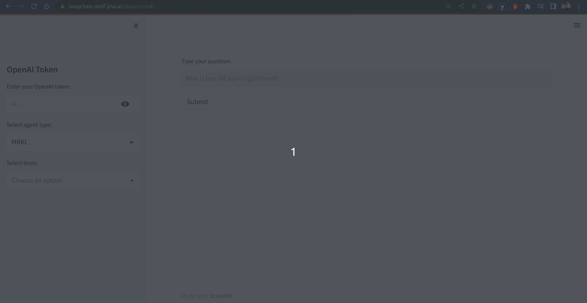
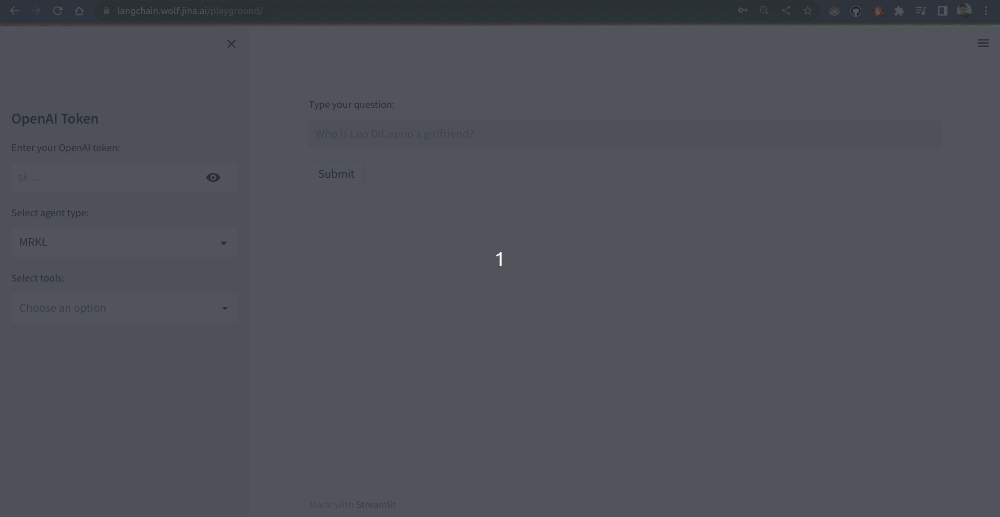

<p align="center">
<b>LangChain Apps on Production with Jina 🚀</b>
</p>

<p align=center>
<a href="https://pypi.org/project/langchain-serve/"></a>
<a href="https://jina.ai/slack"></a>
<a href="https://pypistats.org/packages/langchain-serve"></a>
<a href="https://github.com/jina-ai/langchain-serve/actions/workflows/cd.yml"></a>
</p>


[Jina](https://github.com/jina-ai/jina) is an open-source framework to build, deploy & manage machine learning applications at scale. [LangChain](https://python.langchain.com/en/latest/index.html) is another open-source framework for building applications powered by language models. 

**langchain-serve** helps you deploy your LangChain apps on Jina AI Cloud in just a matter of seconds. You can now benefit from the scalability and serverless architecture of the cloud without sacrificing the ease and convenience of local development.


## 🧠 Babyagi-as-a-service

> Give us a :star: and tell us what more you'd like to see! 

- Deploy `babyagi` on Jina AI Cloud with one command

  ```bash
  lc-serve deploy babyagi
  ```

- Integrate babyagi with external services using our Websocket API. Get a flavor of the integration on your CLI with 
    
  ```bash
  lc-serve playground babyagi
  ```


#### 🎉 Custom Apps to production in 4 simple steps

  1. Refactor your code to function(s) that should be served with `@serving` decorator.
  1. Create a `requirements.txt` file in your app directory to ensure all necessary dependencies are installed.
  1. Run `lc-serve deploy local app` to test your API locally.
  1. Run `lc-serve deploy jcloud app` to deploy on [Jina AI Cloud](https://jina.ai/product/cloud/).


#### 🔥 Scalable, Serverless RESTful/Streaming Websocket APIs on Jina AI Cloud

  - 🌎 RESTful/Websocket APIs with TLS certs in just 2 lines of code change.
  - 🌊 Stream LLM interactions in real-time with Websockets.
  - 👥 Enable human in the loop for your agents.
  - 📄 Swagger UI, and OpenAPI spec included with your APIs.
  - ⚡️ Serverless apps that scales automatically with your traffic.
  - 📊 Builtin logging, monitoring, and traces for your APIs.
  - 🤖 No need to change your code to manage APIs, or manage dockerfiles, or worry about infrastructure!


#### 🚧 Coming soon

- [ ] 🔑 Authorize API endpoints
- [ ] 🛠️ Enable Streamlit playground deployment for your apps


If you have any feature requests or faced any issue, please [let us know](https://github.com/jina-ai/langchain-serve/issues/new)!


## Usage

Let's first install `langchain-serve` using pip.

```bash
pip install langchain-serve
```

## Enable Human-in-the-loop (HITL) for your agents

HITL for LangChain agents on production can be challenging since the agents are typically running on servers where humans don't have direct access. **langchain-serve** bridges this gap by enabling websocket APIs that allow for real-time interaction and feedback between the agent and a human operator.

Check out this [example](examples/websockets/hitl/README.md) to see how you can enable HITL for your agents.


## Enable REST APIs 


Let's build a custom agent using this example taken from [LangChain documentation](https://python.langchain.com/en/latest/modules/agents/agents/custom_agent.html). 


<details>
<summary>Show agent code (app.py)</summary>

```python
# app.py
from langchain.agents import ZeroShotAgent, Tool, AgentExecutor
from langchain import OpenAI, SerpAPIWrapper, LLMChain

search = SerpAPIWrapper()
tools = [
    Tool(
        name = "Search",
        func=search.run,
        description="useful for when you need to answer questions about current events"
    )
]

prefix = """Answer the following questions as best you can, but speaking as a pirate might speak. You have access to the following tools:"""
suffix = """Begin! Remember to speak as a pirate when giving your final answer. Use lots of "Args"

Question: {input}
{agent_scratchpad}"""

prompt = ZeroShotAgent.create_prompt(
    tools, 
    prefix=prefix, 
    suffix=suffix, 
    input_variables=["input", "agent_scratchpad"]
)

llm_chain = LLMChain(llm=OpenAI(temperature=0), prompt=prompt)
tool_names = [tool.name for tool in tools]
agent = ZeroShotAgent(llm_chain=llm_chain, allowed_tools=tool_names)
agent_executor = AgentExecutor.from_agent_and_tools(agent=agent, tools=tools, verbose=True)
agent_executor.run("How many people live in canada as of 2023?")
```

#### Output


```text
> Entering new AgentExecutor chain...
Thought: I need to find out the population of Canada
Action: Search
Action Input: Population of Canada 2023
Observation: The current population of Canada is 38,610,447 as of Saturday, February 18, 2023, based on Worldometer elaboration of the latest United Nations data. Canada 2020 population is estimated at 37,742,154 people at mid year according to UN data.
Thought: I now know the final answer
Final Answer: Arrr, Canada be havin' 38,610,447 scallywags livin' there as of 2023!

> Finished chain.
```

</details>

### Step 1: 

**Refactor your code to function(s) that should be served with `@serving` decorator**


<details>
<summary>Show updated agent code (app.py)</summary>

```python
# app.py
from langchain import LLMChain, OpenAI, SerpAPIWrapper
from langchain.agents import AgentExecutor, Tool, ZeroShotAgent

from lcserve import serving


@serving
def ask(input: str) -> str:
    search = SerpAPIWrapper()
    tools = [
        Tool(
            name="Search",
            func=search.run,
            description="useful for when you need to answer questions about current events",
        )
    ]
    prefix = """Answer the following questions as best you can, but speaking as a pirate might speak. You have access to the following tools:"""
    suffix = """Begin! Remember to speak as a pirate when giving your final answer. Use lots of "Args"

    Question: {input}
    {agent_scratchpad}"""

    prompt = ZeroShotAgent.create_prompt(
        tools,
        prefix=prefix,
        suffix=suffix,
        input_variables=["input", "agent_scratchpad"],
    )

    print(prompt.template)

    llm_chain = LLMChain(llm=OpenAI(temperature=0), prompt=prompt)
    tool_names = [tool.name for tool in tools]
    agent = ZeroShotAgent(llm_chain=llm_chain, allowed_tools=tool_names)

    agent_executor = AgentExecutor.from_agent_and_tools(
        agent=agent, tools=tools, verbose=True
    )

    return agent_executor.run(input)

if __name__ == "__main__":
    ask('How many people live in canada as of 2023?')
```

</details>


##### What changed?

- We moved our code to an `ask` function.
- Added type hints to the function parameters (input and output), so API definition can be generated.
- Imported `from lcserve import serving` and added `@serving` decorator to the `ask` function.
- Added `if __name__ == "__main__":` block to test the function locally.

---

### Step 2:

**Create a `requirements.txt` file in your app directory to ensure all necessary dependencies are installed.**

<details>
<summary>Show requirements.txt</summary>

```text
# requirements.txt
openai
google-search-results
```
</details>

--- 

### Step 3:

**Run `lc-serve deploy local app` to test your API locally.**

> `app` is the name of the module that contains the `ask` function.

```bash
lc-serve deploy local app
```

<details>
<summary>Show output</summary>

```text
────────────────────────────────────────────────────────────────────────────────────────────────────── 🎉 Flow is ready to serve! ───────────────────────────────────────────────────────────────────────────────────────────────────────
╭──────────────────────── 🔗 Endpoint ────────────────────────╮
│  ⛓   Protocol                                         HTTP  │
│  🏠     Local                                 0.0.0.0:8080  │
│  🔒   Private                          192.168.29.185:8080  │
│  🌍    Public  2405:201:d007:e8e7:2c33:cf8e:ed66:2018:8080  │
╰─────────────────────────────────────────────────────────────╯
╭─────────── 💎 HTTP extension ────────────╮
│  💬          Swagger UI        .../docs  │
│  📚               Redoc       .../redoc  │
╰──────────────────────────────────────────╯
```

</details>


Let's open the [Swagger UI](http://localhost:8080/docs) to test our API locally. With `Try it out` button, we can test our API with different inputs.


<details>
<summary>Show Swagger UI</summary>


</details>

Let's test our local API with `How many people live in canada as of 2023?` input with a cURL command.

```bash
curl -X 'POST' \
  'http://localhost:8080/ask' \
  -H 'accept: application/json' \
  -H 'Content-Type: application/json' \
  -d '{
  "input": "How many people live in canada as of 2023?",
  "envs": {
    "OPENAI_API_KEY": "'"${OPENAI_API_KEY}"'",
    "SERPAPI_API_KEY": "'"${SERPAPI_API_KEY}"'"
  }
}'
```

```json
{
  "result": "Arrr, there be 38,645,670 people livin' in Canada as of 2023!",
  "error": "",
  "stdout": "Answer the following questions as best you can, but speaking as a pirate might speak. You have access to the following tools:\n\nSearch: useful for when you need to answer questions about current events\n\nUse the following format:\n\nQuestion: the input question you must answer\nThought: you should always think about what to do\nAction: the action to take, should be one of [Search]\nAction Input: the input to the action\nObservation: the result of the action\n... (this Thought/Action/Action Input/Observation can repeat N times)\nThought: I now know the final answer\nFinal Answer: the final answer to the original input question\n\nBegin! Remember to speak as a pirate when giving your final answer. Use lots of \"Args\"\n\n    Question: {input}\n    {agent_scratchpad}\n\n\n\u001b[1m> Entering new AgentExecutor chain...\u001b[0m\n\u001b[32;1m\u001b[1;3m\nThought: I need to find out how many people live in Canada\nAction: Search\nAction Input: How many people live in Canada as of 2023\u001b[0m\nObservation: \u001b[36;1m\u001b[1;3mThe current population of Canada is 38,645,670 as of Wednesday, March 29, 2023, based on Worldometer elaboration of the latest United Nations data.\u001b[0m\nThought:\u001b[32;1m\u001b[1;3m I now know the final answer\nFinal Answer: Arrr, there be 38,645,670 people livin' in Canada as of 2023!\u001b[0m\n\n\u001b[1m> Finished chain.\u001b[0m"
}
```

##### What happened?

- `POST /ask` is generated from `ask` function defined in `app.py`.
- `input` is an argrment defined in `ask` function. 
- `envs` is a dictionary of environment variables that will be passed to all the functions decorated with `@serving` decorator.
- return type of `ask` function is `str`. So, `result` would carry the return value of `ask` function.
- If there is an error, `error` would carry the error message.
- `stdout` would carry the output of the function decorated with `@serving` decorator.


---

### Step 4:

**Run `lc-serve deploy jcloud app` to deploy your API to Jina AI Cloud.**

```bash
# Login to Jina AI Cloud
jina auth login

# Deploy your app to Jina AI Cloud
lc-serve deploy jcloud app
```

<details>
<summary>Show complete output</summary>

```text
⠇ Pushing `/tmp/tmp7kt5qqrn` ...🔐 You are logged in to Jina AI as ***. To log out, use jina auth logout.
╭────────────────────────── Published ───────────────────────────╮
│                                                                │
│   📛 Name           n-64a15                                    │
│   🔗 Jina Hub URL   https://cloud.jina.ai/executor/6p1zio87/   │
│   👀 Visibility     public                                     │
│                                                                │
╰────────────────────────────────────────────────────────────────╯
╭─────────────────────── 🎉 Flow is available! ───────────────────────╮
│                                                                     │
│   ID               langchain-ee4aef57d9                             │
│   Gateway (Http)   https://langchain-ee4aef57d9-http.wolf.jina.ai   │
│   Dashboard        https://dashboard.wolf.jina.ai/flow/ee4aef57d9   │
│                                                                     │
╰─────────────────────────────────────────────────────────────────────╯
```
</details>


```text
╭──────────────┬─────────────────────────────────────────────────────────────╮
│ AppID        │                    langchain-ee4aef57d9                     │
├──────────────┼─────────────────────────────────────────────────────────────┤
│ Phase        │                           Serving                           │
├──────────────┼─────────────────────────────────────────────────────────────┤
│ Endpoint     │       https://langchain-ee4aef57d9-http.wolf.jina.ai        │
├──────────────┼─────────────────────────────────────────────────────────────┤
│ Swagger UI   │     https://langchain-ee4aef57d9-http.wolf.jina.ai/docs     │
├──────────────┼─────────────────────────────────────────────────────────────┤
│ OpenAPI JSON │ https://langchain-ee4aef57d9-http.wolf.jina.ai/openapi.json │
╰──────────────┴─────────────────────────────────────────────────────────────╯
```

Let's open the Swagger UI to test our API on Jina AI Cloud. With `Try it out` button, we can test our API with different inputs.

<details>
<summary>Show Swagger UI</summary>

<p float="center">
  
  
</p>

</details>


Let's test the API on JCloud with `How many people live in canada as of 2023?` input with a cURL command (Replace the Hostname with your own hostname):

```bash
curl -X 'POST' \
  'https://langchain-ee4aef57d9-http.wolf.jina.ai/ask' \
  -H 'accept: application/json' \
  -H 'Content-Type: application/json' \
  -d '{
  "input": "How many people live in canada as of 2023?",
  "envs": {
    "OPENAI_API_KEY": "'"${OPENAI_API_KEY}"'",
    "SERPAPI_API_KEY": "'"${SERPAPI_API_KEY}"'"
  }
}'
```

```json
{
  "result": "Arrr, there be 38,645,670 people livin' in Canada as of 2023!",
  "error": "",
  "stdout": "Answer the following questions as best you can, but speaking as a pirate might speak. You have access to the following tools:\n\nSearch: useful for when you need to answer questions about current events\n\nUse the following format:\n\nQuestion: the input question you must answer\nThought: you should always think about what to do\nAction: the action to take, should be one of [Search]\nAction Input: the input to the action\nObservation: the result of the action\n... (this Thought/Action/Action Input/Observation can repeat N times)\nThought: I now know the final answer\nFinal Answer: the final answer to the original input question\n\nBegin! Remember to speak as a pirate when giving your final answer. Use lots of \"Args\"\n\n    Question: {input}\n    {agent_scratchpad}\n\n\n\u001b[1m> Entering new AgentExecutor chain...\u001b[0m\n\u001b[32;1m\u001b[1;3m\nThought: I need to find out how many people live in Canada\nAction: Search\nAction Input: How many people live in Canada as of 2023\u001b[0m\nObservation: \u001b[36;1m\u001b[1;3mThe current population of Canada is 38,645,670 as of Wednesday, March 29, 2023, based on Worldometer elaboration of the latest United Nations data.\u001b[0m\nThought:\u001b[32;1m\u001b[1;3m I now know the final answer\nFinal Answer: Arrr, there be 38,645,670 people livin' in Canada as of 2023!\u001b[0m\n\n\u001b[1m> Finished chain.\u001b[0m"
}
```

##### What happened?

- In a matter of few seconds, we've deployed our API on Jina AI Cloud 🎉
- The API is serverless and scalable, so we can scale up the API to handle more requests. 
- You might observe a delay in the first request, that's due to the warm-up time of the API. Subsequent requests will be faster.
- The API includes a Swagger UI and the OpenAPI specification, so it can be easily integrated with other services. 
- Now, other agents can integrate with your agents on Jina AI Cloud thanks to the [OpenAPI Agent](https://python.langchain.com/en/latest/modules/agents/toolkits/examples/openapi.html) 💡


---

#### Reach out to us 📞

- Serverless is not your thing?
- Do you want larger instances for your API?
- Looking for file uploads, or other data-in, data-out features?
- Do you want to setup custom authorization for your API?


📣 Got your attention? [Join us on Slack](https://jina.ai/slack/) and we'd be happy to help you out.

---


### `lc-serve`

`lc-serve` is a CLI tool that helps you to deploy your agents on Jina AI Cloud.


| Description | Command | 
| --- | ---: |
| Deploy your app locally | `lc-serve deploy local app` |
| Deploy your app on Jina AI Cloud | `lc-serve deploy jcloud app` |
| Update existing app on Jina AI Cloud | `lc-serve deploy jcloud app --app-id <app-id>` |
| Get app status on Jina AI Cloud | `lc-serve status <app-id>` |
| List all apps on Jina AI Cloud | `lc-serve list` |
| Remove app on Jina AI Cloud | `lc-serve remove <app-id>` |


---

### Agents Playground 🕹️🎮🌐

[LangChain agents](https://python.langchain.com/en/latest/modules/agents/getting_started.html) use LLMs to determine the actions to be taken in what order. An action can either be using a tool and observing its output, or returning to the user. We've hosted a **[Streamlit Playground](https://langchain.wolf.jina.ai/playground/)** on Jina AI Cloud to interact with the agents, which accepts with following inputs:

- **[Agent Types](https://python.langchain.com/en/latest/modules/agents/agents.html):** Choose from different agent types that Langchain supports. 

- **[Tools](https://python.langchain.com/en/latest/modules/agents/tools.html):** Choose from different tools that Langchain supports. Some tools may require an API token or other related arguments.

To use the playground, simply type your input in the text box provided to get the agent's output and chain of thought. Enjoy exploring Langchain's capabilities! In addition to streamlit, you can also use our RESTful APIs on the playground to interact with the agents. 


### [Zero-shot React Description agent with SerpAPI and Calculator](https://python.langchain.com/en/latest/modules/agents/getting_started.html)

#### Streamlit Playground



#### RESTful API

```bash
export OPENAI_API_KEY=sk-***
export SERPAPI_API_KEY=***

curl -sX POST 'https://langchain.wolf.jina.ai/api/run' \
  -H 'accept: application/json' \
  -H 'Content-Type: application/json' \
  --data-raw '{
    "text": "Who is Leo DiCaprios girlfriend? What is her current age raised to the 0.43 power?",
    "parameters": {
        "tools": {
            "tool_names": ["serpapi", "llm-math"]
        },
        "agent": "zero-shot-react-description",
        "verbose": true
    },
    "envs": {
        "OPENAI_API_KEY": "'"${OPENAI_API_KEY}"'",
        "SERPAPI_API_KEY": "'"${SERPAPI_API_KEY}"'"
    }
}' | jq
``` 

```json
{
  "result": "Camila Morrone is Leo DiCaprio's girlfriend, and her current age raised to the 0.43 power is 3.6261260611529527.",
  "chain_of_thought": "\u001b[1m> Entering new AgentExecutor chain...\u001b[0m\u001b[32;1m\u001b[1;3m I need to find out the name of Leo's girlfriend and then use the calculator to calculate her age to the 0.43 power.Action: SearchAction Input: Leo DiCaprio girlfriend\u001b[0mObservation: \u001b[36;1m\u001b[1;3mDiCaprio met actor Camila Morrone in December 2017, when she was 20 and he was 43. They were spotted at Coachella and went on multiple vacations together. Some reports suggested that DiCaprio was ready to ask Morrone to marry him. The couple made their red carpet debut at the 2020 Academy Awards.\u001b[0mThought:\u001b[32;1m\u001b[1;3m I need to use the calculator to calculate her age to the 0.43 powerAction: CalculatorAction Input: 20^0.43\u001b[0mObservation: \u001b[33;1m\u001b[1;3mAnswer: 3.6261260611529527\u001b[0mThought:\u001b[32;1m\u001b[1;3m I now know the final answerFinal Answer: Camila Morrone is Leo DiCaprio's girlfriend, and her current age raised to the 0.43 power is 3.6261260611529527.\u001b[0m\u001b[1m> Finished chain.\u001b[0m"
}
```

### [Self Ask With Search](https://python.langchain.com/en/latest/modules/agents/implementations/self_ask_with_search.html)

#### Streamlit Playground



#### RESTful API

```bash
export OPENAI_API_KEY=sk-***
export SERPAPI_API_KEY=***

curl -sX POST 'https://langchain.wolf.jina.ai/api/run' \
  -H 'accept: application/json' \
  -H 'Content-Type: application/json' \
  --data-raw '{
    "text": "What is the hometown of the reigning mens U.S. Open champion?",
    "parameters": {
        "tools": {
            "tool_names": ["serpapi"]
        },
        "agent": "self-ask-with-search",
        "verbose": true
    },
    "envs": {
        "OPENAI_API_KEY": "'"${OPENAI_API_KEY}"'",
        "SERPAPI_API_KEY": "'"${SERPAPI_API_KEY}"'"
    }
}' | jq
```

```json
{
  "result": "El Palmar, Murcia, Spain",
  "chain_of_thought": "\u001b[1m> Entering new AgentExecutor chain...\u001b[0m\u001b[32;1m\u001b[1;3m Yes.Follow up: Who is the reigning mens U.S. Open champion?\u001b[0mIntermediate answer: \u001b[36;1m\u001b[1;3mCarlos Alcaraz Garfia\u001b[0m\u001b[32;1m\u001b[1;3mFollow up: What is Carlos Alcaraz Garfia's hometown?\u001b[0mIntermediate answer: \u001b[36;1m\u001b[1;3mCarlos Alcaraz Garfia was born on May 5, 2003, in El Palmar, Murcia, Spain to parents Carlos Alcaraz González and Virginia Garfia Escandón. He has three siblings.\u001b[0m\u001b[32;1m\u001b[1;3mSo the final answer is: El Palmar, Murcia, Spain\u001b[0m\u001b[1m> Finished chain.\u001b[0m"
}
```

---

## Chains on Jina 📦🚀

[Chains](https://python.langchain.com/en/latest/modules/chains/getting_started.html) in LangChain allow users to combine components to create a single, coherent application. With Jina, 

- You can expose your `Chain` as RESTful/gRPC/WebSocket API.
- Enable `Chain`s to deploy & scale separately from the rest of your application with the help of Executors.
- Deploy your `Chain` on Jina AI Cloud and get exclusive access to Agents on Jina AI Cloud (coming soon)

### Examples

| Example | LangChain Docs | Description |
| ------- | ----------- | ----------- |
| [LLM Chain](examples/llm_chain.md) | [Link](https://langchain.readthedocs.io/en/latest/modules/chains/getting_started.html#query-an-llm-with-the-llmchain) | Expose `Chain` as RESTful/gRPC/WebSocket API locally |
| [Simple Sequential Chain](examples/simple_sequential_chain.md) | [Link](https://langchain.readthedocs.io/en/latest/modules/chains/generic/sequential_chains.html#simplesequentialchain) | Expose `Chain` as RESTful/gRPC/WebSocket API locally |
| [Sequential Chain](examples/sequential_chain.md) | [Link](https://langchain.readthedocs.io/en/latest/modules/chains/generic/sequential_chains.html#sequential-chain) | Expose `Chain` as RESTful/gRPC/WebSocket API locally |
| [LLM Math Chain](examples/llm_math.md) | [Link](https://langchain.readthedocs.io/en/latest/modules/chains/examples/llm_math.html) | Expose `Chain` as RESTful/gRPC/WebSocket API locally |
| [LLM Requests Chain](examples/llm_requests_chain.md) | [Link](https://langchain.readthedocs.io/en/latest/modules/chains/examples/llm_requests.html) | Expose `Chain` as RESTful/gRPC/WebSocket API locally |
| [Custom Chain](examples/custom_chain.md) | [Link](https://langchain.readthedocs.io/en/latest/modules/chains/getting_started.html#create-a-custom-chain-with-the-chain-class) | Expose `Chain` as RESTful/gRPC/WebSocket API locally |
| [Sequential Chains](examples/sequential_executors.md) | N/A | Build & scale `Chains` in separate `Executor`s |
| [Branching Chains](examples/branching.md) | N/A | Branching `Chains` in separate `Executor`s to allow parallel execution |

## Frequently Asked Questions

- [My client that connects to the App gets timed-out, what should I do?](#my-client-that-connects-to-the-app-gets-timed-out-what-should-I-do)
- [JCloud deployment failed at pushing image to Jina Hubble, what should I do?](#jcloud-deployment-failed-at-pushing-image-to-jina-hubble-what-should-i-di)

### My client that connects to the App gets timed-out, what should I do?

If you make long HTTP requests, you may experience timeouts due to limitations in the OSS we used in `langchain-serve`. While we are working to permanently address this issue, we recommend using HTTP/1.1 in your client as a temporary workaround.

### JCloud deployment failed at pushing image to Jina Hubble, what should I do?

Please use `--verbose` and retry to get more information. If you are operating on computer with `arm64` arch, please retry with `--platform linux/amd64` so the image can be built correctly.
