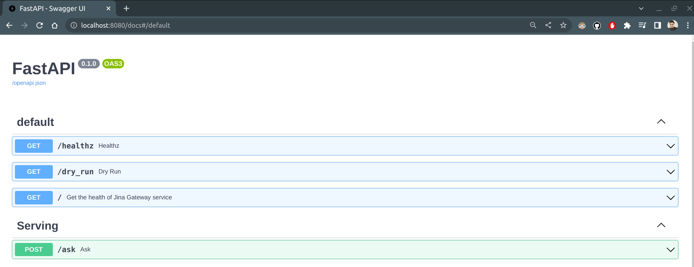
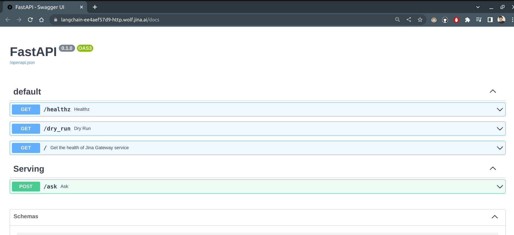
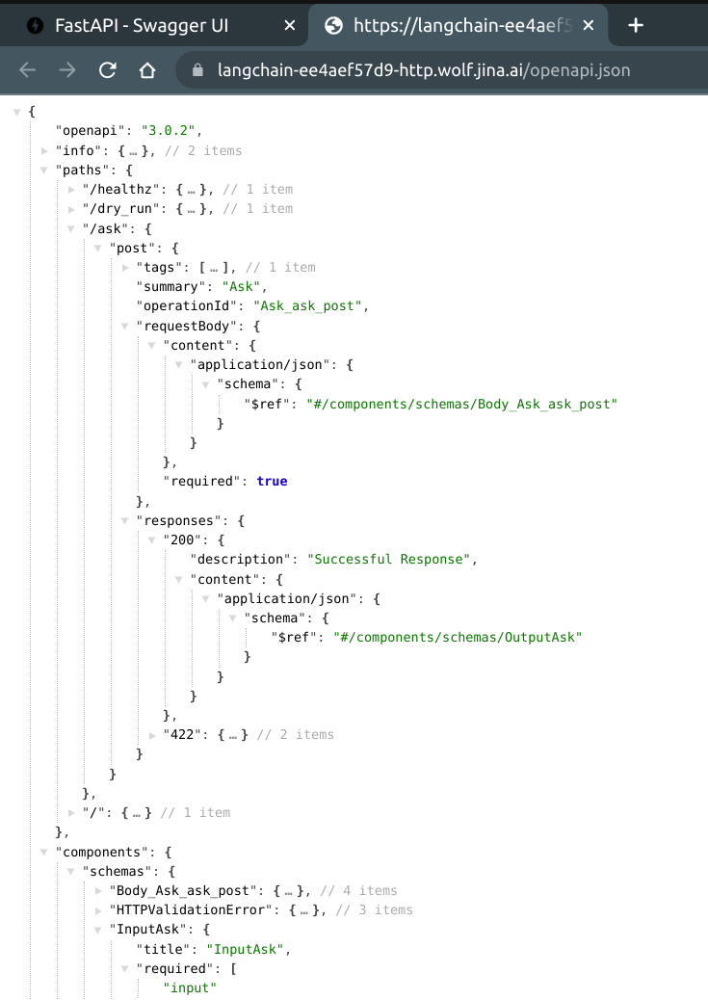

<p align="center">
<h2 align="center">⚡ LangChain Apps on Production with Jina & FastAPI 🚀</h2>
</p>

<p align=center>
<a href="https://pypi.org/project/langchain-serve/"></a>
<a href="https://discord.jina.ai"></a>
<a href="https://pypistats.org/packages/langchain-serve"></a>
<a href="https://github.com/jina-ai/langchain-serve/actions/workflows/cd.yml"></a>
</p>


[Jina](https://github.com/jina-ai/jina) is an open-source framework for building scalable multi modal AI apps on Production. [LangChain](https://python.langchain.com/en/latest/index.html) is another open-source framework for building applications powered by LLMs.

**langchain-serve** helps you deploy your LangChain apps on Jina AI Cloud in just a matter of seconds. You can now benefit from the scalability and serverless architecture of the cloud without sacrificing the ease and convenience of local development.

> Give us a :star: and tell us what more you'd like to see! 

# ☁️ LLM Apps as-a-service

langchain-serve currently wraps following apps as a service to be deployed on Jina AI Cloud with one command.

## 🔮 AutoGPT-as-a-service

[AutoGPT](https://github.com/Significant-Gravitas/Auto-GPT) is an "AI agent" that given a goal in natural language, will attempt to achieve it by breaking it into sub-tasks and using the internet and other tools in an automatic loop.

<details>
<summary>Show usage</summary>

- Deploy `autogpt` on Jina AI Cloud with one command

  ```bash
  lc-serve deploy autogpt
  ```

  <details>
  <summary>Show command output</summary>

  ```text
  ╭──────────────┬────────────────────────────────────────────────────────────────────────────────────────────────────────╮
  │ App ID       │                                           autogpt-6cbd489454                                           │
  ├──────────────┼────────────────────────────────────────────────────────────────────────────────────────────────────────┤
  │ Phase        │                                                Serving                                                 │
  ├──────────────┼────────────────────────────────────────────────────────────────────────────────────────────────────────┤
  │ Endpoint     │                                 wss://autogpt-6cbd489454.wolf.jina.ai                                  │
  ├──────────────┼────────────────────────────────────────────────────────────────────────────────────────────────────────┤
  │ App logs     │                                        dashboards.wolf.jina.ai                                         │
  ├──────────────┼────────────────────────────────────────────────────────────────────────────────────────────────────────┤
  │ Swagger UI   │                              https://autogpt-6cbd489454.wolf.jina.ai/docs                              │
  ├──────────────┼────────────────────────────────────────────────────────────────────────────────────────────────────────┤
  │ OpenAPI JSON │                          https://autogpt-6cbd489454.wolf.jina.ai/openapi.json                          │
  ╰──────────────┴────────────────────────────────────────────────────────────────────────────────────────────────────────╯
  ```

  </details>

- Integrate autogpt with external services using APIs. Get a flavor of the integration on your CLI with 
    
  ```bash
  lc-serve playground autogpt
  ```

  <details>
  <summary>Show playground</summary>
  
  </details>

</details>

## 🧠 Babyagi-as-a-service

[Babyagi](https://github.com/yoheinakajima/babyagi) is a task-driven autonomous agent that uses LLMs to create, prioritize, and execute tasks. It is a general-purpose AI agent that can be used to automate a wide variety of tasks.

<details>
<summary>Show usage</summary>

- Deploy `babyagi` on Jina AI Cloud with one command

  ```bash
  lc-serve deploy babyagi
  ```

- Integrate babyagi with external services using our Websocket API. Get a flavor of the integration on your CLI with 
    
  ```bash
  lc-serve playground babyagi
  ```

  <details>
  <summary>Show playground</summary>
  
  </details>

</details>

## :panda_face: pandas-ai-as-a-service

[pandas-ai](https://github.com/gventuri/pandas-ai) integrates LLM capabilities into Pandas, to make dataframes conversational in Python code. Thanks to langchain-serve, we can now expose pandas-ai APIs on Jina AI Cloud in just a matter of seconds.

<details>
<summary>Show usage</summary>

- Deploy **pandas-ai** on Jina AI Cloud

  ```bash
  lc-serve deploy pandas-ai
  ```

  <details>
  <summary>Show command output</summary>

  ```text
  ╭──────────────┬─────────────────────────────────────────────────────────────────────────────────╮
  │ App ID       │                               pandasai-06879349ca                               │
  ├──────────────┼─────────────────────────────────────────────────────────────────────────────────┤
  │ Phase        │                                     Serving                                     │
  ├──────────────┼─────────────────────────────────────────────────────────────────────────────────┤
  │ Endpoint     │                     wss://pandasai-06879349ca.wolf.jina.ai                      │
  ├──────────────┼─────────────────────────────────────────────────────────────────────────────────┤
  │ App logs     │                             dashboards.wolf.jina.ai                             │
  ├──────────────┼─────────────────────────────────────────────────────────────────────────────────┤
  │ Swagger UI   │                  https://pandasai-06879349ca.wolf.jina.ai/docs                  │
  ├──────────────┼─────────────────────────────────────────────────────────────────────────────────┤
  │ OpenAPI JSON │              https://pandasai-06879349ca.wolf.jina.ai/openapi.json              │
  ╰──────────────┴─────────────────────────────────────────────────────────────────────────────────╯
  ```

  </details>

- Upload your DataFrame to Jina AI Cloud (Optional - you can also use a publicly available CSV)

  - Define your DataFrame in a Python file
    
    ```python
    # dataframe.py
    import pandas as pd
    df = pd.DataFrame(some_data)
    ```

  - Upload your DataFrame to Jina AI Cloud using `<module>:<variable>` syntax
    
    ```bash
    lc-serve util upload-df dataframe:df
    ```

- Conversationalize your DataFrame using pandas-ai APIs. Get a flavor of the integration with a local playground on your CLI with 
  
  ```bash
  lc-serve playground pandas-ai <host>
  ```
  <details>
  <summary>Show playground</summary>
  
  </details>

</details>

## 💬 Question Answer Bot on PDFs

`pdfqna` is a simple question answering bot that uses LLMs to answer questions on PDF documents, showcasing the how easy it is to integrate langchain apps on Jina AI Cloud.

<details>
<summary>Show usage</summary>

- Deploy `pdf_qna` on Jina AI Cloud with one command

  ```bash
  lc-serve deploy pdf-qna
  ```

- Get a flavor of the integration with Streamlit playground on your CLI with 
    
  ```bash
  lc-serve playground pdf-qna
  ```
  <details>
  <summary>Show playground</summary>
  
  </details>

- Expand the Q&A bot to multiple languages, different document types & integrate with external services using simple REST APIs.

  https://github.com/jina-ai/langchain-serve/blob/8f7a9272e99490a5357655becfc5da3569655f38/lcserve/apps/pdf_qna/app.py#L8-L12

</details>

# 💪 Features

### 🎉 LLM Apps on production
  
  - 👉 **[Define your API using `@serving` decorator](#-rest-apis-using-serving-decorator)** OR,
  - 👉 **[Bring your own FastAPI app](#-bring-your-own-fastapi-app)** !

### 🔥 Secure, Scalable, Serverless, Streaming REST/Websocket APIs on [Jina AI Cloud](https://cloud.jina.ai/).

  - 🌎 Globally available REST/Websocket APIs with automatic TLS certs.
  - 🌊 Stream LLM interactions in real-time with Websockets.
  - 👥 Enable human in the loop for your agents.
  - 🔑 Protect your APIs with [API authorization](#-authorize-your-apis) using Bearer tokens.
  - 📄 Swagger UI, and OpenAPI spec included with your APIs.
  - ⚡️ Serverless, autoscaling apps that scales automatically with your traffic.
  - 📁 Persistent storage (EFS) mounted on your app for your data.
  - 📊 Builtin logging, monitoring, and traces for your APIs.
  - 🤖 No need to change your code to manage APIs, or manage dockerfiles, or worry about infrastructure!


If you have any feature requests or faced any issue, please [let us know](https://github.com/jina-ai/langchain-serve/issues/new)!


# 🧰 Usage

Let's first install `langchain-serve` using pip.

```bash
pip install langchain-serve
```

## 🔄 REST APIs using `@serving` decorator

Let's build & deploy a custom agent using this example taken from [LangChain documentation](https://python.langchain.com/en/latest/modules/agents/agents/custom_agent.html). 


<details>
<summary>Show example</summary>

<details>
<summary>Show agent code (app.py)</summary>

```python
# app.py
from langchain.agents import ZeroShotAgent, Tool, AgentExecutor
from langchain import OpenAI, SerpAPIWrapper, LLMChain

search = SerpAPIWrapper()
tools = [
    Tool(
        name = "Search",
        func=search.run,
        description="useful for when you need to answer questions about current events"
    )
]

prefix = """Answer the following questions as best you can, but speaking as a pirate might speak. You have access to the following tools:"""
suffix = """Begin! Remember to speak as a pirate when giving your final answer. Use lots of "Args"

Question: {input}
{agent_scratchpad}"""

prompt = ZeroShotAgent.create_prompt(
    tools, 
    prefix=prefix, 
    suffix=suffix, 
    input_variables=["input", "agent_scratchpad"]
)

llm_chain = LLMChain(llm=OpenAI(temperature=0), prompt=prompt)
tool_names = [tool.name for tool in tools]
agent = ZeroShotAgent(llm_chain=llm_chain, allowed_tools=tool_names)
agent_executor = AgentExecutor.from_agent_and_tools(agent=agent, tools=tools, verbose=True)
agent_executor.run("How many people live in canada as of 2023?")
```

#### Output


```text
> Entering new AgentExecutor chain...
Thought: I need to find out the population of Canada
Action: Search
Action Input: Population of Canada 2023
Observation: The current population of Canada is 38,610,447 as of Saturday, February 18, 2023, based on Worldometer elaboration of the latest United Nations data. Canada 2020 population is estimated at 37,742,154 people at mid year according to UN data.
Thought: I now know the final answer
Final Answer: Arrr, Canada be havin' 38,610,447 scallywags livin' there as of 2023!

> Finished chain.
```

</details>

### Step 1: 

**Refactor your code to function(s) that should be served with `@serving` decorator**


<details>
<summary>Show updated agent code (app.py)</summary>

```python
# app.py
from langchain import LLMChain, OpenAI, SerpAPIWrapper
from langchain.agents import AgentExecutor, Tool, ZeroShotAgent

from lcserve import serving


@serving
def ask(input: str) -> str:
    search = SerpAPIWrapper()
    tools = [
        Tool(
            name="Search",
            func=search.run,
            description="useful for when you need to answer questions about current events",
        )
    ]
    prefix = """Answer the following questions as best you can, but speaking as a pirate might speak. You have access to the following tools:"""
    suffix = """Begin! Remember to speak as a pirate when giving your final answer. Use lots of "Args"

    Question: {input}
    {agent_scratchpad}"""

    prompt = ZeroShotAgent.create_prompt(
        tools,
        prefix=prefix,
        suffix=suffix,
        input_variables=["input", "agent_scratchpad"],
    )

    print(prompt.template)

    llm_chain = LLMChain(llm=OpenAI(temperature=0), prompt=prompt)
    tool_names = [tool.name for tool in tools]
    agent = ZeroShotAgent(llm_chain=llm_chain, allowed_tools=tool_names)

    agent_executor = AgentExecutor.from_agent_and_tools(
        agent=agent, tools=tools, verbose=True
    )

    return agent_executor.run(input)

if __name__ == "__main__":
    ask('How many people live in canada as of 2023?')
```

</details>


##### What changed?

- We moved our code to an `ask` function.
- Added type hints to the function parameters (input and output), so API definition can be generated.
- Imported `from lcserve import serving` and added `@serving` decorator to the `ask` function.
- Added `if __name__ == "__main__":` block to test the function locally.

---

### Step 2:

**Create a `requirements.txt` file in your app directory to ensure all necessary dependencies are installed.**

<details>
<summary>Show requirements.txt</summary>

```text
# requirements.txt
openai
google-search-results
```
</details>

--- 

### Step 3:

**Run `lc-serve deploy local app` to test your API locally.**

> `app` is the name of the module that contains the `ask` function.

```bash
lc-serve deploy local app
```

<details>
<summary>Show output</summary>

```text
────────────────────────────────────────────────────────────────────────────────────────────────────── 🎉 Flow is ready to serve! ───────────────────────────────────────────────────────────────────────────────────────────────────────
╭──────────────────────── 🔗 Endpoint ────────────────────────╮
│  ⛓   Protocol                                         HTTP  │
│  🏠     Local                                 0.0.0.0:8080  │
│  🔒   Private                          192.168.29.185:8080  │
│  🌍    Public  2405:201:d007:e8e7:2c33:cf8e:ed66:2018:8080  │
╰─────────────────────────────────────────────────────────────╯
╭─────────── 💎 HTTP extension ────────────╮
│  💬          Swagger UI        .../docs  │
│  📚               Redoc       .../redoc  │
╰──────────────────────────────────────────╯
```

</details>


Let's open the [Swagger UI](http://localhost:8080/docs) to test our API locally. With `Try it out` button, we can test our API with different inputs.


<details>
<summary>Show Swagger UI</summary>



</details>

Let's test our local API with `How many people live in canada as of 2023?` input with a cURL command.

```bash
curl -X 'POST' \
  'http://localhost:8080/ask' \
  -H 'accept: application/json' \
  -H 'Content-Type: application/json' \
  -d '{
  "input": "How many people live in canada as of 2023?",
  "envs": {
    "OPENAI_API_KEY": "'"${OPENAI_API_KEY}"'",
    "SERPAPI_API_KEY": "'"${SERPAPI_API_KEY}"'"
  }
}'
```

```json
{
  "result": "Arrr, there be 38,645,670 people livin' in Canada as of 2023!",
  "error": "",
  "stdout": "Answer the following questions as best you can, but speaking as a pirate might speak. You have access to the following tools:\n\nSearch: useful for when you need to answer questions about current events\n\nUse the following format:\n\nQuestion: the input question you must answer\nThought: you should always think about what to do\nAction: the action to take, should be one of [Search]\nAction Input: the input to the action\nObservation: the result of the action\n... (this Thought/Action/Action Input/Observation can repeat N times)\nThought: I now know the final answer\nFinal Answer: the final answer to the original input question\n\nBegin! Remember to speak as a pirate when giving your final answer. Use lots of \"Args\"\n\n    Question: {input}\n    {agent_scratchpad}\n\n\n\u001b[1m> Entering new AgentExecutor chain...\u001b[0m\n\u001b[32;1m\u001b[1;3m\nThought: I need to find out how many people live in Canada\nAction: Search\nAction Input: How many people live in Canada as of 2023\u001b[0m\nObservation: \u001b[36;1m\u001b[1;3mThe current population of Canada is 38,645,670 as of Wednesday, March 29, 2023, based on Worldometer elaboration of the latest United Nations data.\u001b[0m\nThought:\u001b[32;1m\u001b[1;3m I now know the final answer\nFinal Answer: Arrr, there be 38,645,670 people livin' in Canada as of 2023!\u001b[0m\n\n\u001b[1m> Finished chain.\u001b[0m"
}
```

##### What happened?

- `POST /ask` is generated from `ask` function defined in `app.py`.
- `input` is an argrment defined in `ask` function. 
- `envs` is a dictionary of environment variables that will be passed to all the functions decorated with `@serving` decorator.
- return type of `ask` function is `str`. So, `result` would carry the return value of `ask` function.
- If there is an error, `error` would carry the error message.
- `stdout` would carry the output of the function decorated with `@serving` decorator.


---

### Step 4:

**Run `lc-serve deploy jcloud app` to deploy your API to Jina AI Cloud.**

```bash
# Login to Jina AI Cloud
jina auth login

# Deploy your app to Jina AI Cloud
lc-serve deploy jcloud app
```

<details>
<summary>Show complete output</summary>

```text
⠇ Pushing `/tmp/tmp7kt5qqrn` ...🔐 You are logged in to Jina AI as ***. To log out, use jina auth logout.
╭────────────────────────── Published ───────────────────────────╮
│                                                                │
│   📛 Name           n-64a15                                    │
│   🔗 Jina Hub URL   https://cloud.jina.ai/executor/6p1zio87/   │
│   👀 Visibility     public                                     │
│                                                                │
╰────────────────────────────────────────────────────────────────╯
╭─────────────────────── 🎉 Flow is available! ───────────────────────╮
│                                                                     │
│   ID               langchain-ee4aef57d9                             │
│   Gateway (Http)   https://langchain-ee4aef57d9-http.wolf.jina.ai   │
│   Dashboard        https://dashboard.wolf.jina.ai/flow/ee4aef57d9   │
│                                                                     │
╰─────────────────────────────────────────────────────────────────────╯
```
</details>


```text
╭──────────────┬─────────────────────────────────────────────────────────────╮
│ AppID        │                    langchain-ee4aef57d9                     │
├──────────────┼─────────────────────────────────────────────────────────────┤
│ Phase        │                           Serving                           │
├──────────────┼─────────────────────────────────────────────────────────────┤
│ Endpoint     │       https://langchain-ee4aef57d9-http.wolf.jina.ai        │
├──────────────┼─────────────────────────────────────────────────────────────┤
│ Swagger UI   │     https://langchain-ee4aef57d9-http.wolf.jina.ai/docs     │
├──────────────┼─────────────────────────────────────────────────────────────┤
│ OpenAPI JSON │ https://langchain-ee4aef57d9-http.wolf.jina.ai/openapi.json │
╰──────────────┴─────────────────────────────────────────────────────────────╯
```

Let's open the Swagger UI to test our API on Jina AI Cloud. With `Try it out` button, we can test our API with different inputs.

<details>
<summary>Show Swagger UI</summary>

<p float="center">
  
  
</p>

</details>


Let's test the API on JCloud with `How many people live in canada as of 2023?` input with a cURL command (Replace the Hostname with your own hostname):

```bash
curl -X 'POST' \
  'https://langchain-ee4aef57d9-http.wolf.jina.ai/ask' \
  -H 'accept: application/json' \
  -H 'Content-Type: application/json' \
  -d '{
  "input": "How many people live in canada as of 2023?",
  "envs": {
    "OPENAI_API_KEY": "'"${OPENAI_API_KEY}"'",
    "SERPAPI_API_KEY": "'"${SERPAPI_API_KEY}"'"
  }
}'
```

```json
{
  "result": "Arrr, there be 38,645,670 people livin' in Canada as of 2023!",
  "error": "",
  "stdout": "Answer the following questions as best you can, but speaking as a pirate might speak. You have access to the following tools:\n\nSearch: useful for when you need to answer questions about current events\n\nUse the following format:\n\nQuestion: the input question you must answer\nThought: you should always think about what to do\nAction: the action to take, should be one of [Search]\nAction Input: the input to the action\nObservation: the result of the action\n... (this Thought/Action/Action Input/Observation can repeat N times)\nThought: I now know the final answer\nFinal Answer: the final answer to the original input question\n\nBegin! Remember to speak as a pirate when giving your final answer. Use lots of \"Args\"\n\n    Question: {input}\n    {agent_scratchpad}\n\n\n\u001b[1m> Entering new AgentExecutor chain...\u001b[0m\n\u001b[32;1m\u001b[1;3m\nThought: I need to find out how many people live in Canada\nAction: Search\nAction Input: How many people live in Canada as of 2023\u001b[0m\nObservation: \u001b[36;1m\u001b[1;3mThe current population of Canada is 38,645,670 as of Wednesday, March 29, 2023, based on Worldometer elaboration of the latest United Nations data.\u001b[0m\nThought:\u001b[32;1m\u001b[1;3m I now know the final answer\nFinal Answer: Arrr, there be 38,645,670 people livin' in Canada as of 2023!\u001b[0m\n\n\u001b[1m> Finished chain.\u001b[0m"
}
```

##### What happened?

- In a matter of few seconds, we've deployed our API on Jina AI Cloud 🎉
- The API is serverless and scalable, so we can scale up the API to handle more requests. 
- You might observe a delay in the first request, that's due to the warm-up time of the API. Subsequent requests will be faster.
- The API includes a Swagger UI and the OpenAPI specification, so it can be easily integrated with other services. 
- Now, other agents can integrate with your agents on Jina AI Cloud thanks to the [OpenAPI Agent](https://python.langchain.com/en/latest/modules/agents/toolkits/examples/openapi.html) 💡

</details>

---

## 🔐 Authorize your APIs

To add an extra layer of security, we can integrate any custom API authorization by adding a `auth` argument to the `@serving` decorator. 

<details>
<summary>Show code & gotchas</summary>

```python
from lcserve import serving

def authorizer(token: str) -> Any:
    if not token == 'mysecrettoken':            # Change this to add your own authorization logic
        raise Exception('Unauthorized')         # Raise an exception if the request is not authorized

    return 'userid'                             # Return any user id or object

@serving(auth=authorizer)
def ask(question: str, **kwargs) -> str:
    auth_response = kwargs['auth_response']     # This will be 'userid'
    return ...

@serving(websocket=True, auth=authorizer)
async def talk(question: str, **kwargs) -> str:
    auth_response = kwargs['auth_response']     # This will be 'userid'
    return ...
```

##### 🤔 Gotchas about the `auth` function

- Should accept only one argument `token`.
- Should raise an Exception if the request is not authorized.
- Can return any object, which will be passed to the `auth_response` object under `kwargs` to the functions.
- Expects Bearer token in the `Authorization` header of the request.
- Sample HTTP request with `curl`:
  ```bash
  curl -X 'POST' 'http://localhost:8080/ask' -H 'Authorization: Bearer mysecrettoken' -d '{ "question": "...", "envs": {} }'
  ```
- Sample WebSocket request with `wscat`:
  ```bash
  wscat -H "Authorization: Bearer mysecrettoken" -c ws://localhost:8080/talk
  ```

</details>

---

## 🙋‍♂️ Enable streaming & human-in-the-loop (HITL) with WebSockets

HITL for LangChain agents on production can be challenging since the agents are typically running on servers where humans don't have direct access. **langchain-serve** bridges this gap by enabling websocket APIs that allow for real-time interaction and feedback between the agent and a human operator.

Check out this [example](examples/websockets/hitl/README.md) to see how you can enable HITL for your agents.

## 📁 Persistent storage on Jina AI Cloud

Every app deployed on Jina AI Cloud gets a persistent storage (EFS) mounted locally which can be accessed via `workspace` kwarg in the `@serving` function.

<details>
<summary>Show code</summary>

```python
from lcserve import serving

@serving
def store(text: str, **kwargs):
    workspace: str = kwargs.get('workspace')
    path = f'{workspace}/store.txt'
    print(f'Writing to {path}')
    with open(path, 'a') as f:
        f.writelines(text + '\n')
    return 'OK'


@serving(websocket=True)
async def stream(**kwargs):
    workspace: str = kwargs.get('workspace')
    websocket: WebSocket = kwargs.get('websocket')
    path = f'{workspace}/store.txt'
    print(f'Streaming {path}')
    async with aiofiles.open(path, 'r') as f:
        async for line in f:
            await websocket.send_text(line)
    return 'OK'
```

Here, we are using the `workspace` to store the incoming text in a file via the REST endpoint and streaming the contents of the file via the WebSocket endpoint.

</details>

## 🚀 Bring your own FastAPI app

If you already have a FastAPI app with pre-defined endpoints, you can use `lc-serve` to deploy it on Jina AI Cloud. 

```bash
lc-serve deploy jcloud --app filename:app 
```

<details>
<summary>Show details</summary>

Let's take an example of a simple FastAPI app with directory structure

```bash
.
└── endpoints.py
```

```python
# endpoints.py
from typing import Union

from fastapi import FastAPI

app = FastAPI()


@app.get("/status")
def read_root():
    return {"Hello": "World"}


@app.get("/items/{item_id}")
def read_item(item_id: int, q: Union[str, None] = None):
    return {"item_id": item_id, "q": q}
```

```bash
lc-serve deploy jcloud --app endpoints:app
```

</details>

---

## 💻 `lc-serve` CLI

`lc-serve` is a simple CLI that helps you to deploy your agents on Jina AI Cloud (JCloud) 


| Description | Command | 
| --- | ---: |
| Deploy your app locally | `lc-serve deploy local app` |
| Deploy your app on JCloud | `lc-serve deploy jcloud app` |
| Deploy FastAPI app on JCloud | `lc-serve deploy jcloud --app <app-name>:<app-object>` |
| Update existing app on JCloud | `lc-serve deploy jcloud app --app-id <app-id>` |
| Get app status on JCloud | `lc-serve status <app-id>` |
| List all apps on JCloud | `lc-serve list` |
| Remove app on JCloud | `lc-serve remove <app-id>` |

# 💡 JCloud Deployment
## ⚙️ Configurations

For JCloud deployment, you can configure your application infrastructure by providing a YAML configuration file using the `--config` option. The supported configurations are:

  - Instance type (`instance`), as defined by [Jina AI Cloud](https://docs.jina.ai/concepts/jcloud/configuration/#cpu-tiers).
  - Minimum number of replicas for your application (`autoscale_min`). Setting it 0 enables [serverless](https://en.wikipedia.org/wiki/Serverless_computing).
  - Disk size (`disk_size`), in GB. The default value is 1 GB.

For example:

```
instance: C4
autoscale_min: 0
disk_size: 1.5G
```

You can alternatively include a `jcloud.yaml` file in your application directory with the desired configurations. However, please note that if the `--config` option is explicitly used in the command line interface, the local jcloud.yaml file will be disregarded. The command line provided configuration file will take precedence.

If you don't provide a configuration file or a specific configuration isn't specified, the following default settings will be applied: 

```
instance: C3
autoscale_min: 1
disk_size: 1G
```

## 💰 Pricing

Applications hosted on JCloud are priced in two categories:

**Base credits**

- Base credits are charged to ensure high availability for your application by maintaining at least one instance running continuously, ready to handle incoming requests.
- Actual credits charged for base credits are calculated based on the [instance type as defined by Jina AI Cloud](https://docs.jina.ai/concepts/jcloud/configuration/#cpu-tiers).
- By default, instance type `C3` is used with a minimum of 1 instance and efs disk of size 1G, which means that if your application is served on JCloud, you will be charged ~10 credits per hour.
- You can change the instance type and the minimum number of instances by providing a YAML configuration file using the `--config` option. For example, if you want to use instance type `C4` with a minimum of 0 replicas, you can provide the following configuration file:
  ```yaml
  instance: C4
  autoscale_min: 0
  ```

**Serving credits**

- Serving credits are charged when your application is actively serving incoming requests.
- Actual credits charged for serving credits are calculated based on the credits for the instance type multiplied by the duration for which your application serves requests. 
- You are charged for each second your application is serving requests.


**Total credits charged = Base credits + Serving credits**. ([Jina AI Cloud](https://cloud.jina.ai/pricing) defines each credit as €0.005)

### Examples

**Example 1:**

Consider an HTTP application that has served requests for `10` minutes in the last hour and uses a custom config:
```
instance: C4
autoscale_min: 0
```

Total credits per hour charged would be `3.33`. The calculation is as follows:
```
C4 instance has an hourly credit rate of 20.
Base credits = 0 (since `autoscale_min` is 0)
Serving credits = 20 * 10/60 = 3.33
Total credits per hour = 3.33
```

**Example 2:**

Consider a WebSocket application that had active connections for 20 minutes in the last hour and uses the default configuration.
```
instance: C3
autoscale_min: 1
```

Total credits per hour charged would be `13.33`. The calculation is as follows:
```
C3 instance has an hourly credit rate of 10.
Base credits = 10 (since `autoscale_min` is 1)
Serving credits = 10 * 20/60 = 3.33
Total credits per hour = 10 + 3.33 = 13.33
```

# ❓ Frequently Asked Questions

- [My client that connects to the JCloud hosted App gets timed-out, what should I do?](#my-client-that-connects-to-the-jcloud-hosted-app-gets-timed-out-what-should-I-do)
- [JCloud deployment failed at pushing image to Jina Hubble, what should I do?](#jcloud-deployment-failed-at-pushing-image-to-jina-hubble-what-should-i-di)
- [Debug babyagi playground request/response for external integration](#debug-babyagi-playground-requestresponse-for-external-integration)

### My client that connects to the JCloud hosted App gets timed-out, what should I do?

If you make long HTTP/ WebSocket requests, the default timeout value (2 minutes) might not be suitable for your use case. You can provide a custom timeout value during JCloud deployment by using the `--timeout` argument.

Additionally, for HTTP, you may also experience timeouts due to limitations in the OSS we used in `langchain-serve`. While we are working to permanently address this issue, we recommend using HTTP/1.1 in your client as a temporary workaround.

For WebSocket, please note that the connection will be closed if idle for more than 5 minutes.

### JCloud deployment failed at pushing image to Jina Hubble, what should I do?

Please use `--verbose` and retry to get more information. If you are operating on computer with `arm64` arch, please retry with `--platform linux/amd64` so the image can be built correctly.

### Debug babyagi playground request/response for external integration

1. Start textual console in a terminal (exclude following groups to reduce the noise in logging)
    
    ```bash
    textual console -x EVENT -x SYSTEM -x DEBUG
    ```

2. Start the playground with `--verbose` flag. Start interacting and see the logs in the console.
    
    ```bash
    lc-serve playground babyagi --verbose
    ```

# 📞 Reach out to us

- Serverless is not your thing?
- Do you want larger instances for your API?
- Looking for file uploads, or other data-in, data-out features?

📣 Got your attention? [Join us on Discord](https://discord.jina.ai) and we'd be happy to help you out.
