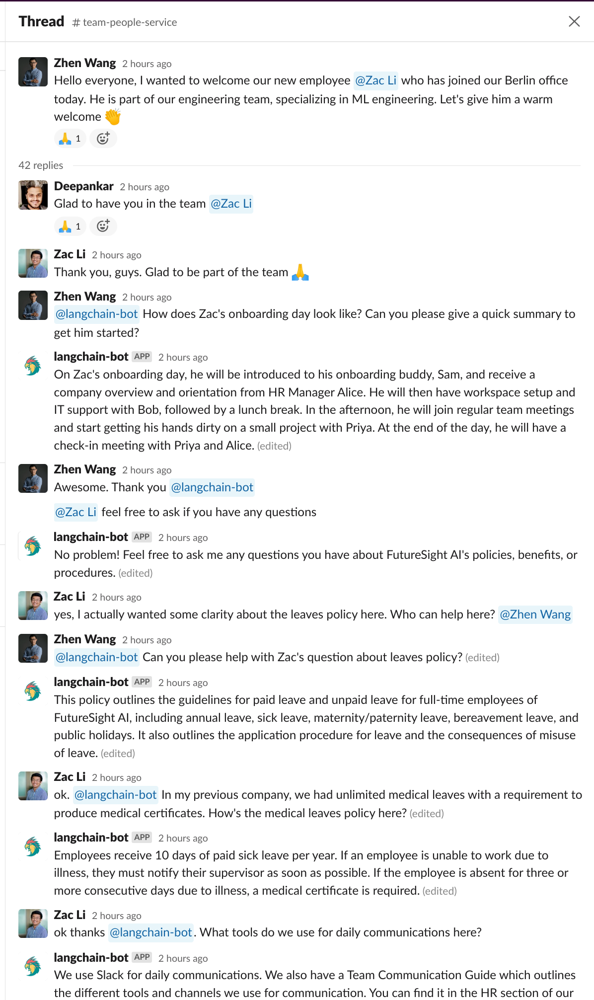
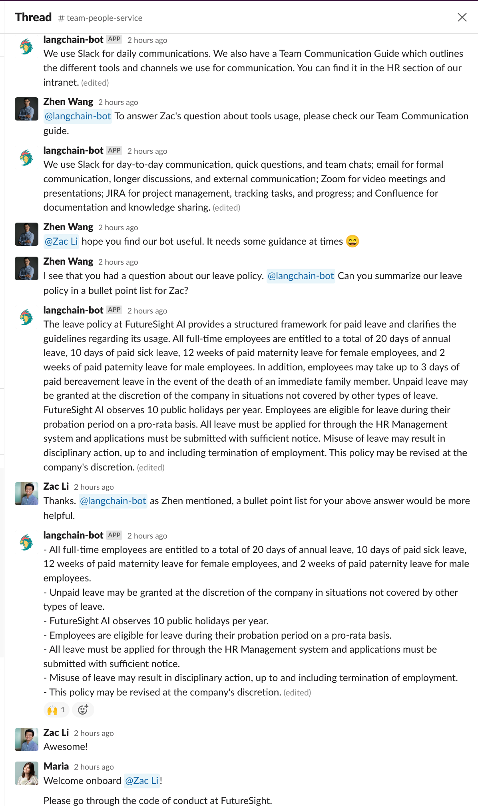
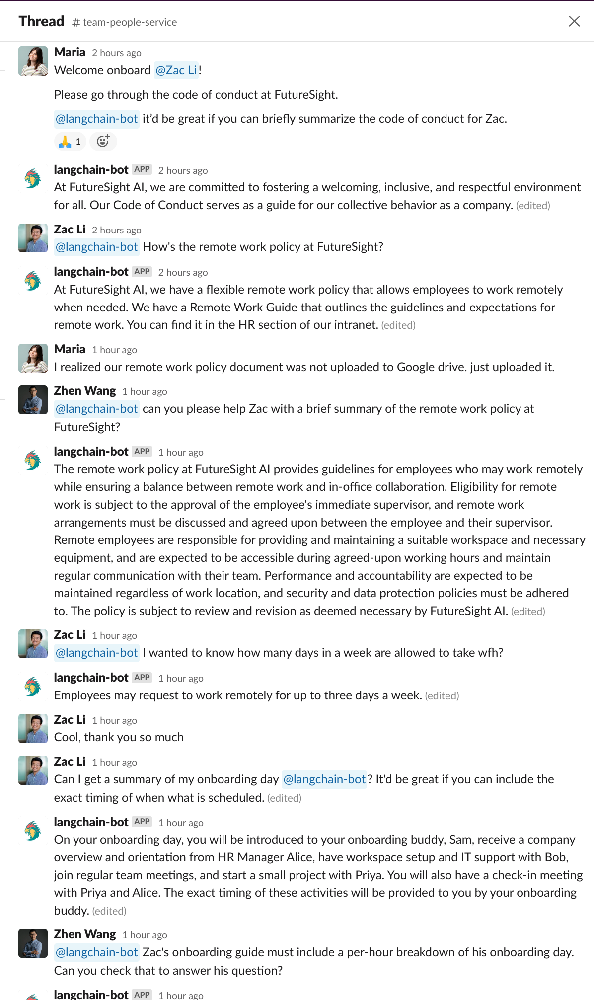
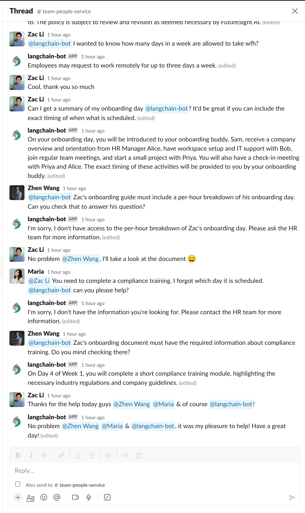
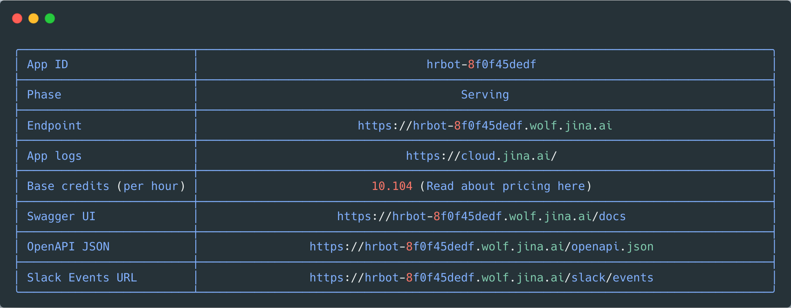
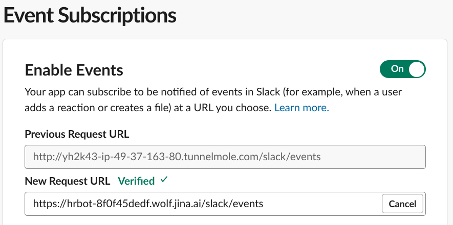
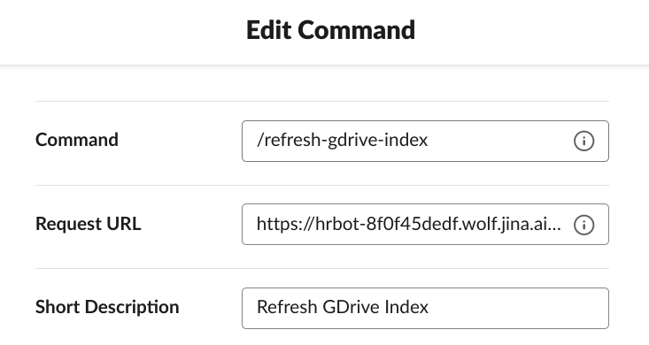

# 🤖👔 HR Slack Bot

Following is a step-by-step guide to build & deploy a customizable LLM-powered Slack bot designed to streamline & automate various HR tasks and interactions on Slack based in PDF documents on internal Google Drive. It is designed to assist both employees and the HR team, enhancing efficiency and engagement within the workspace.


<table align="center">
  <thead>
    <tr>
      <th colspan="4" style="text-align:center;">HR Bot helping a new employee & the HR team with onboarding & queries about the HR policies</th>
    </tr>
  </thead>
  <tbody>
    <tr>
      <td></td>
      <td></td>
      <td></td>
      <td></td>
    </tr>
    <tr>
      <td align="center">1</td>
      <td align="center">2</td>
      <td align="center">3</td>
      <td align="center">4</td>
    </tr>
  </tbody>
</table>


### 👉 Step 1: Install langchain-serve

Let's start by installing langchain-serve if you haven't already

```bash
pip install langchain-serve
```

To get this example code on your local, you can clone this repo and navigate to the `examples/hrbot` directory.

```bash
git clone https://github.com/jina-ai/langchain-serve.git
cd langchain-serve/examples/hrbot
```

### 👉 Step 2: Create the app manifest

Slack apps can be created from scratch or, from a manifest. You can copy the following manifest and use it to create your app.
```yaml
display_information:
  name: langchain-hrbot
  background_color: "#25272e"
features:
  bot_user:
    display_name: langchain-hrbot
    always_online: true
  slash_commands:
    - command: /refresh-gdrive-index
      url: https://your-app.wolf.jina.ai/slack/events
      description: Refresh GDrive Index
      should_escape: false
    - command: /remove-gdrive-index
      url: https://your-app.wolf.jina.ai/slack/events
      description: Remove GDrive index from workspace
      should_escape: false
oauth_config:
  redirect_urls:
    - https://cloud.jina.ai/
  scopes:
    bot:
      - app_mentions:read
      - channels:history
      - chat:write
      - groups:history
      - groups:read
      - im:history
      - im:read
      - im:write
      - users.profile:read
      - channels:read
      - commands
settings:
  event_subscriptions:
    request_url: https://your-app.wolf.jina.ai/slack/events
    bot_events:
      - app_mention
      - message.im
  org_deploy_enabled: false
  socket_mode_enabled: false
  token_rotation_enabled: false
                                                              
```

### 👉 Step 3: Create the app and configure it

- Go to [slack apps](https://api.slack.com/apps?new_app=1) page.
- Choose `From an app manifest` and pick the workspace you want to install the app in.
- Paste the YAML manifest from the previous step and click `Create`.

You will be redirected to the app configuration page. Your app needs 2 tokens to work.

- **Signing Secret**

    - This is used to verify that the request is coming from Slack. 
    - You can find it under `Basic Information` -> `App Credentials` -> `Signing Secret`. Copy it and save it somewhere safe. 
    - It'd be used as `SLACK_SIGNING_SECRET` in the next step.

- **Bot User OAuth Token**

    - This is used to authenticate the bot user. 
    - To get a token, you'd first need to install it to your workspace. Go to `Install App` -> `Install to Workspace`. You will be asked to authorize the app. Once you do that, you will be redirected back to the app configuration page. 
    - You can find the token under `OAuth & Permissions` -> `OAuth Tokens for Your Workspace`. Copy it and save it somewhere safe. 
    - It'd be used as `SLACK_BOT_TOKEN` in the next step.

### 👉 Step 4: Create required `.env` file

Create a `.env` file with the following content. Replace the values with the ones you got in the previous step. Without these, the bot won't be able to authenticate itself with Slack.

```bash
SLACK_SIGNING_SECRET=<your-signing-secret>
SLACK_BOT_TOKEN=<your-bot-token>
OPENAI_API_TOKEN=<your-openai-api-token>
```

### 👉 Step 5: Create your GDrive service account and download the credentials

To allow the bot to access the pdf files in your GDrive, you need to create a service account and download the credentials. You can read more about it [here](https://developers.google.com/identity/protocols/oauth2/service-account#creatinganaccount). Once you have the credentials, save it as `gdrive-service-account.json` in the `examples/hrbot` directory.

### 👉 Step 6: Deploy the app

You can deploy the app using the following command.

```bash
lc-serve deploy jcloud app --env .env
```

<p align="center">
  
</p>

### 👉 Step 7: Configure the app to use the deployed URL

1. Go to `Event Subscriptions` -> `Request URL` and set it to the Events URL you got in the previous step. Upon saving, Slack will send a request to the URL to verify it. If everything is configured correctly, you will see a green Verified checkmark. If you see an error instead, check the logs of the deployment on [Jina AI Cloud](https://cloud.jina.ai/user/flows).

<p align="center">
  
</p>

2. Go to `Slash Commands` and edit the `/refresh-gdrive-index` & `/remove-gdrive-index` commands. Set the Request URL to the Events URL you got in the previous step. 

<p align="center">
  
</p>
