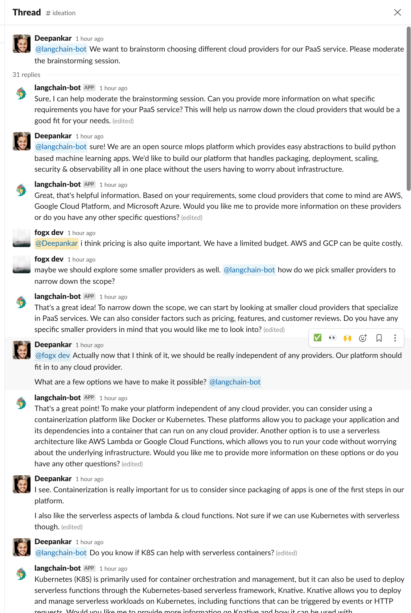
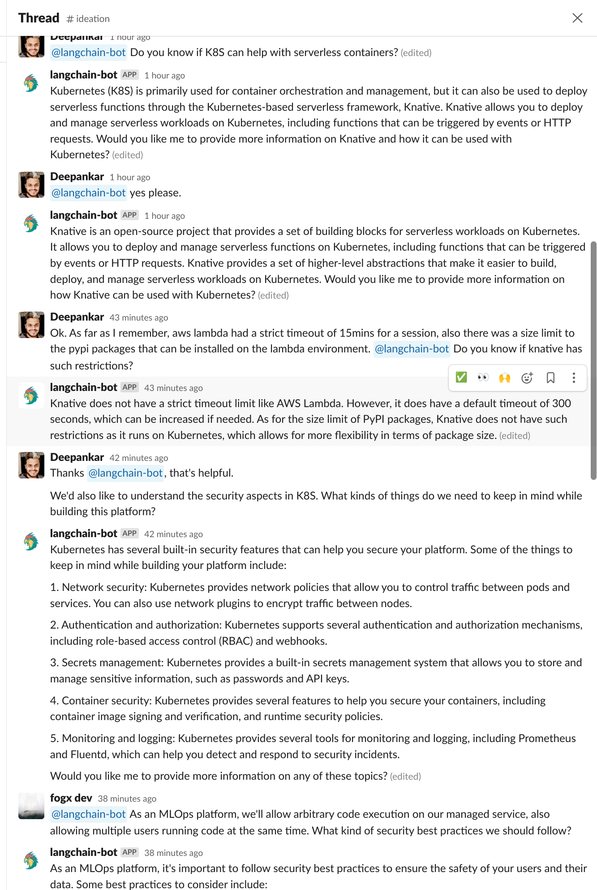
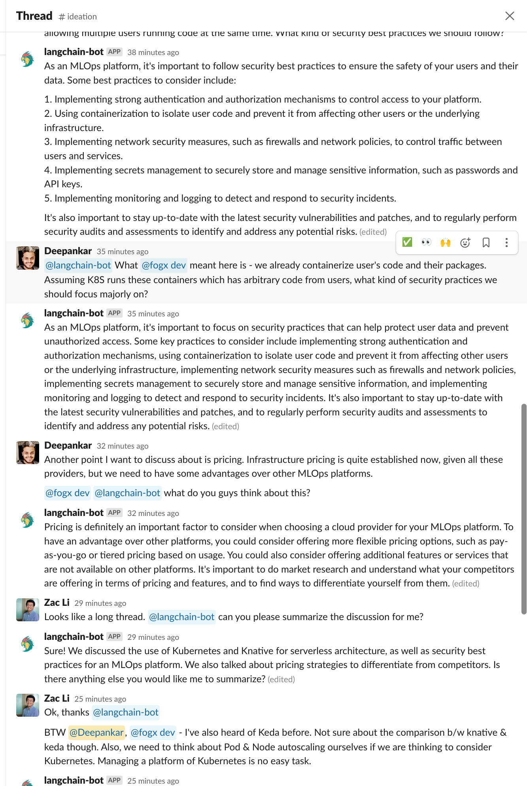
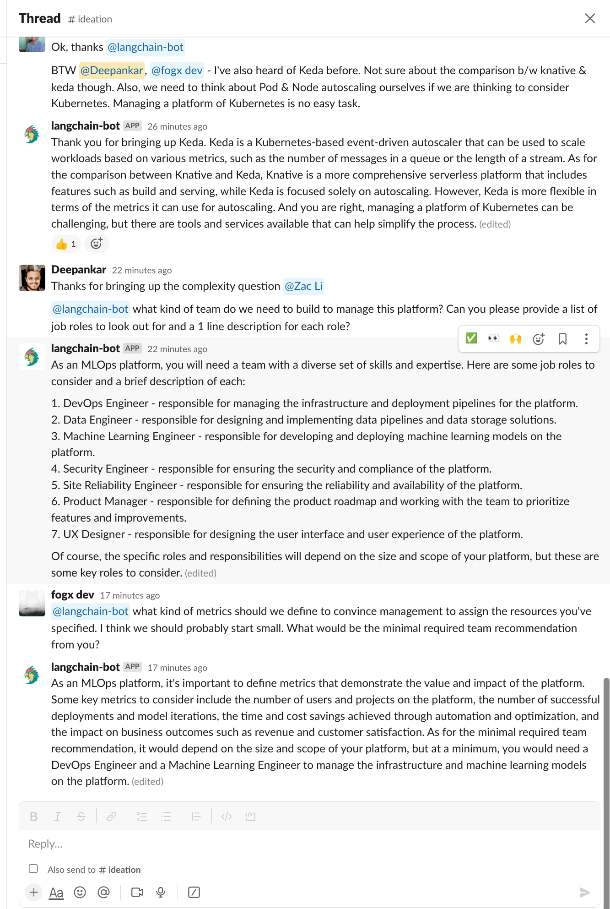

# LangChain Slack Bots on [Jina AI Cloud](https://cloud.jina.ai/)

Complementing its capacity to deploy robust APIs for your LangChain applications, `langchain-serve` also brings your the ability to launching conversational bots on Slack using LangChain components. This is a step-by-step guide to build, deploy and distribute a Slack bot using `langchain-serve`. 

<table align="center">
  <tr>
    <td></td>
    <td></td>
    <td></td>
    <td></td>
  </tr>
  <tr>
    <td align="center">1</td>
    <td align="center">2</td>
    <td align="center">3</td>
    <td align="center">4</td>
  </tr>
</table>


### 👉 Step 1: Install langchain-serve

Let's start by installing langchain-serve if you haven't already

```bash
pip install langchain-serve
```

### 👉 Step 2: Create the app manifest

Slack apps can be created from scratch or, from a manifest. We have a command to generate the manifest for you.

```bash
lcserve util slack-app-manifest --name <custom-name>
```

This will generate a manifest like the following. You can also copy this and use it to create your app.
```yaml
display_information:
  name: langchain-bot
features:
  bot_user:
    display_name: langchain-bot
    always_online: true
oauth_config:
  redirect_urls:
    - https://cloud.jina.ai/
  scopes:
    bot:
      - app_mentions:read
      - channels:history
      - chat:write
      - groups:history
      - groups:read
      - im:history
      - im:read
      - im:write
      - users.profile:read
      - channels:read
settings:
  event_subscriptions:
    request_url: https://your-app.wolf.jina.ai/slack/events
    bot_events:
      - app_mention
      - message.im
  org_deploy_enabled: false
  socket_mode_enabled: false
  token_rotation_enabled: false                                                              
```

### 👉 Step 3: Create the app and configure it

- Go to [slack apps](https://api.slack.com/apps?new_app=1) page.
- Choose `From an app manifest` and pick the workspace you want to install the app in.
- Paste the YAML manifest from the previous step and click `Create`.

You will be redirected to the app configuration page. Your app needs 2 tokens to work.

- **Signing Secret**

    - This is used to verify that the request is coming from Slack. 
    - You can find it under `Basic Information` -> `App Credentials` -> `Signing Secret`. Copy it and save it somewhere safe. 
    - It'd be used as `SLACK_SIGNING_SECRET` in the next step.

- **Bot User OAuth Token**

    - This is used to authenticate the bot user. 
    - To get a token, you'd first need to install it to your workspace. Go to `Install App` -> `Install to Workspace`. You will be asked to authorize the app. Once you do that, you will be redirected back to the app configuration page. 
    - You can find the token under `OAuth & Permissions` -> `OAuth Tokens for Your Workspace`. Copy it and save it somewhere safe. 
    - It'd be used as `SLACK_BOT_TOKEN` in the next step.

### 👉 Step 4: Deploy the demo langchain bot on Jina AI Cloud

Create a `.env` file with the following content. Replace the values with the ones you got in the previous step. Without these, the bot won't be able to authenticate itself with Slack.

```bash
SLACK_SIGNING_SECRET=<your-signing-secret>
SLACK_BOT_TOKEN=<your-bot-token>
OPENAI_API_TOKEN=<your-openai-api-token>
```

```bash
lc-serve deploy slackbot-demo --env .env
```

After the deployment is complete, you will see `Slack Events URL` in the output, which would look something like `https://slackbot-123456789.wolf.jina.ai/slack/events`. Copy this URL and go to the next step.

<details>
<summary>Show output</summary>

```bash
╭─────────────────────────┬──────────────────────────────────────────────────────────────────────╮
│ App ID                  │                         slackbot-29e8522b50                          │
├─────────────────────────┼──────────────────────────────────────────────────────────────────────┤
│ Phase                   │                               Serving                                │
├─────────────────────────┼──────────────────────────────────────────────────────────────────────┤
│ Endpoint                │               https://slackbot-29e8522b50.wolf.jina.ai               │
├─────────────────────────┼──────────────────────────────────────────────────────────────────────┤
│ App logs                │                        https://cloud.jina.ai/                        │
├─────────────────────────┼──────────────────────────────────────────────────────────────────────┤
│ Base credits (per hour) │                     10.04 (Read about pricing here)                  │
├─────────────────────────┼──────────────────────────────────────────────────────────────────────┤
│ Swagger UI              │            https://slackbot-29e8522b50.wolf.jina.ai/docs             │
├─────────────────────────┼──────────────────────────────────────────────────────────────────────┤
│ OpenAPI JSON            │        https://slackbot-29e8522b50.wolf.jina.ai/openapi.json         │
├─────────────────────────┼──────────────────────────────────────────────────────────────────────┤
│ Slack Events URL        │        https://slackbot-29e8522b50.wolf.jina.ai/slack/events         │
╰─────────────────────────┴──────────────────────────────────────────────────────────────────────╯
```

</details>

### 👉 Step 5: Configure the app to use the deployed endpoint

Go to `Event Subscriptions` -> `Request URL` and set it to the Events URL you got in the previous step. Upon saving, Slack will send a request to the URL to verify it. If everything is configured correctly, you will see a green Verified checkmark. If you see an error instead, check the logs of the deployment on [Jina AI Cloud](https://cloud.jina.ai/user/flows).

### 👉 Step 6: Use the bot on Slack

There are 2 ways to interact with the bot.

- **Mention the bot in a thread in a channel**

    - Go to any channel and invite the bot by typing `/invite @<bot-name>`.
    - Every conversation with the bot should tag it. The bot won't get any messages that don't tag it.
    - It only accesses the messages in the thread it's tagged in to keep it in LLM context. It doesn't have access to the messages in the channel.


- **Send a direct message to the bot**

    - Go to `Direct Messages` and send a message to the bot. It will respond to you in the same thread.
    - You can also share other slack thread urls with the bot to answer questions about other conversations.

---

### 👉 Step 7: Enhance the bot to suit your application

Let's dig deep into the demo bot code and see how it works. This example uses Agents with Tools & Chat conversation memory to answer questions from Slack threads. 


```python
from langchain.agents import AgentExecutor, ConversationalAgent
from langchain.memory import ChatMessageHistory
from langchain.prompts import PromptTemplate
from langchain.tools import Tool

def update_cache(path):
    from langchain.cache import SQLiteCache
    langchain.llm_cache = SQLiteCache(database_path=path / "llm_cache.db")

@slackbot
def agent(
    message: str,
    prompt: PromptTemplate,
    history: ChatMessageHistory,
    tools: List[Tool],
    reply: Callable,
    workspace: str,
    **kwargs,
):
    from langchain import LLMChain
    from langchain.chat_models import ChatOpenAI

    update_cache(workspace)
    memory = get_memory(history)
    agent = ConversationalAgent(
        llm_chain=LLMChain(
            llm=ChatOpenAI(temperature=0, verbose=True),
            prompt=prompt,
        ),
        allowed_tools=[tool.name for tool in tools],
    )
    agent_executor = AgentExecutor.from_agent_and_tools(
        agent=agent,
        tools=tools,
        memory=memory,
        verbose=True,
        max_iterations=4,
        handle_parsing_errors=True,
    )
    reply(agent_executor.run(message))
```

We define a decorator `@slackbot` to mark this function as the entrypoint to the bot, used by the `lc-serve` CLI to identify the slackbot function. Functions wrapped with `@slackbot` take the following arguments:

| Parameter | Type | Description |
|---|---|:---:|
| `message` | `str` | Current message that the user sent to the bot |
| `prompt` | `PromptTemplate` | Predefined prompt for the agent |
| `history` | `ChatMessageHistory` | History of the conversation in the thread |
| `tools` | `List[Tool]` | Predefined slack tools for the agent. More predefined tools, user-defined tools can be added here. |
| `reply` | `Callable` | A function to send a reply back to the user |
| `workspace` | `str` | Persistent storage path (can be used to cache llm calls) |


##### Prompt

We use a [predefined prompt template](https://github.com/jina-ai/langchain-serve/blob/98a586254cfe0b01409a5ce7e6d4af23d57bff32/lcserve/backend/slackbot/slackbot.py#L303) for the agent to act like a Slack bot. This can be easily extended to fit your application.


##### Memory
Since slack threads can be long and go beyond the token limits for LLMs, we use `memory` modules defined in `langchain` to store the conversation history. The [get_memory function](https://github.com/jina-ai/langchain-serve/blob/98a586254cfe0b01409a5ce7e6d4af23d57bff32/lcserve/backend/slackbot/memory.py#L29) is just some opinionated memory objects generated from conversation history. You can use custom memory objects as well - e.g.- [LlamaIndex's memory wrappers](https://github.com/jerryjliu/llama_index/blob/main/examples/langchain_demo/LangchainDemo.ipynb).


##### Tools
Likewise, we have a pre-defined tool for Slack - a [slack thread parser](https://github.com/jina-ai/langchain-serve/blob/98a586254cfe0b01409a5ce7e6d4af23d57bff32/lcserve/backend/slackbot/slackbot.py#L147) that extracts the conversation history from the thread UR and makes it available in current context. This proves useful when the user shares a different thread URL with the bot. This can be extended to other [pre-defined tools in langchain](https://python.langchain.com/docs/modules/agents/tools/) or, [custom tools](https://python.langchain.com/docs/modules/agents/tools/how_to/custom_tools)  can be built as per the requirements. 


##### Workspace
Every bot deployed on Jina AI Cloud gets a persistent storage path. This can be used to cache LLM calls to speed up the response time. This can also be used to store other files that the bot needs to access.


##### Reply
The `reply` function is used to send a reply back to the user. It takes a single argument - `message` - which is the reply message to be sent to the user.


### 👉 Step 8: Deploy your customized bot on Jina AI Cloud

After customizing the bot to suit your application, you can deploy it on Jina AI Cloud & use the new Slack Events URL in the app configuration page.

```bash
lc-serve deploy jcloud app --env .env
```

### 👉 Step 9: Distribute your bot to the world

Once you have a bot that works for your application, you can go to `Manage Distribution` -> `Add to Slack` to get sharaable links for your bot. You can read more about how to distribute your bot to the world [here](https://api.slack.com/start/distributing).


## 👀 What's next?

- [Learn more about Langchain](https://python.langchain.com/docs/)
- [Learn more about langchain-serve](https://github.com/jina-ai/langchain-serve)
- Have questions? [Join our Discord community](https://discord.jina.ai/)
